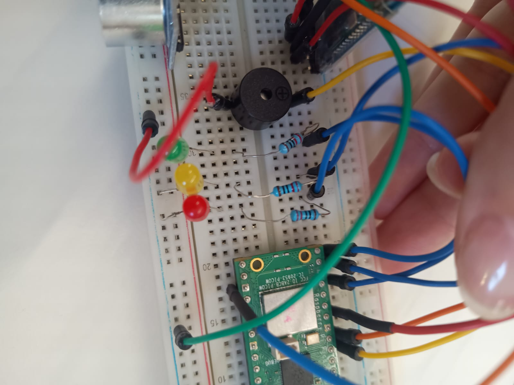

# Semafor inteligent

## Universitatea Tehnică „Gheorghe Asachi” Iași
## Facultatea de Automatică și Calculatoare Iași
## Specializarea: Calculatoare și Tehnologia Informației
## Disciplina: Sisteme cu microprocesoare

**Studenți:** 
- **Vasile LEȘAN 1307B**: testare initiala a componentelor(Leduri, modul bluetooth, buzzer)
- **Șerban-Ilie LOSTUN 1307B**: control bluetooth, testare UART, integrare control fortat si automat, mentinere mod manual sau automat
- **Ioana-Simina RUSU 1307B**: asamblare circuit, verificare alimentare corecta, realizarea schemei circuitului, documentatie

**Profesor îndrumător:** 
- **ș.l.dr.ing. Alexandru-Tudor POPOVICI**


**Data:** 08.06.2025
## Cuprins
1. [Descrierea proiectului](#descrierea-proiectului)
    1. [Componente Hardware](#componente-hardware)
    2. [Funcționalități Software](#funcționalități-software)
    3. [Configurare pini GPIO](#configurare-pini-gpio)
2. [Arhitectura sistemului](#arhitectura-sistemului)
3. [Configurare proiect](#configurare-proiect)
4. [Anexe](#anexe)
    1. [Părți semnificative ale codului sursă](#părți-semnificative-ale-codului-sursă)
    2. [Ilustrarea sistemului implementat](#ilustrarea-sistemului-implementat)
5. [Concluzie](#concluzie)
6. [Referințe](#referințe)


## Descrierea proiectului 
Proiectul reprezinta un sistem de semafor inteligent realizat cu raspberry pi pico si controlabil prin bluetooth. Acesta detecteaza prezenta unui obiect in fata semaforului si schimba automat culoarea ledurilor, cu semnal sonor pentru avertizare. Sistemul poate fi controlat si manual prin comenzi bluetooth.
Proiectul este util in intelegerea interactiunii cu senzori, emiterea comenzilor in timp real si dezvoltarea sistemelor incorporate simple cu functionalitati extinse.


## Componente Hardware

- **Raspberry Pi Pico cu microprocesor RP 2040:** Microcontrolerul principal care rulează codul MicroPython, citește senzorul, controlează LED-urile, buzzerul și comunică prin Bluetooth.

- **Modul ultrasonic HC-SR04:** Trimite unde ultrasonice (TRIG), măsoară timpul până la revenirea ecoului (ECHO), din acel timp se calculează distanța până la obstacol.

- **Modul bluetooth HC-05:** Primește comenzi de tip text prin aplicație terminal bluetooth.

- **LED-uri: roșu, galben, verde:** Fiecare LED este conectat la un pin GPIO și controlat prin cod (on/off).

- **Buzzer Activ:** Avertizare sonoră, emite bip-uri dacă un obiect se apropie prea mult, semnal sonor la schimbarea din verde în roșu,

- **Fire de conexiune si breadboard:** Conectează toate componentele fără lipire.


## Funcționalități software
- **Control semafor automat in funcție de distanța detectată:**
- **Semnal sonor daca obiectul este prea aproape**
- **Trecere automată roșu -> verde și invers cu galben intermediar** 
- **Comenzi bluetooth: start, stop, roșu, verde**
- **Blocare senzor timp de 5 secunde după revenire pe verde(sleep pentru a putea trece mașina de semafor)**
- **Structurare modulară în fișiere separate: main.py, leds.py. sensor.py. buzzer.py**  


## Configurare pini GPIO
- **Comunicare senzor HC SR-04**
  - GND: PIN38(GND)
  - VCC: PIN40
  - ECHO: Rezistență 1kohm (GPIO10)
  - TRIG: PIN12(GPIO9)
- **Comunicare Bluetooth HC-05:**
  - GND_BLUETOOTH: PIN38(GND)
  - VCC: PIN40
  - RX_BLUETOOTH: GPIO1
  - TX_BLUETOOTH: GPIO0
- **LED-uri+rezistențe:**
  - Led rosu: GPIO15
  - Led galben: GPIO14
  - Led verde: GPIO13
- **Buzzer activ**
   - ANOD: GPIO8
   - CATOD: PIN38(GND)
 

 
## Arhitectura sistemului
- **main.py**
Punctul de pornire al programului.
- **components/leds.py**
Clasa pentru controlul ledurilor
- **components/sensor.py**
Clasa pentru citirea distanței
- **components/buzzer.py**
Clasa pentru emiterea semnalelor sonore

## Configurare proiect
În funcție de utilitarul dorit urmărim unul din tutorialele:
- VSCode: https://randomnerdtutorials.com/raspberry-pi-pico-vs-code-micropython/#flash-micropython
- Thonny: https://projects.raspberrypi.org/en/projects/getting-started-with-the-pico/
- Laborator 6: https://edu.tuiasi.ro/mod/page/view.php?id=32140

Pentru programarea si testarea proiectului s-au folosit:
- Thonny ide (mod micropython raspberry pi pico)

- Salvarea fisierelor direct pe placa in structura:
main.py, folder components/ cu fisierele: leds.py, sensor.py, buzzer.py

- Rularea main.py dupa conectare usb si reset soft

- Aplicatie bluetooth terminal (android) pentru testarea comenzilor

## Schema electronica


## Anexe
### Părți semnificative ale codului sursă:
1. **Clasa pentru controlul led-urilor:**
    ```python
    from time import sleep
    from machine import Pin

    class LedController:
        def __init__(self, red_pin, yellow_pin, green_pin):
        self.red = Pin(red_pin, Pin.OUT)
        self.yellow = Pin(yellow_pin, Pin.OUT)
        self.green = Pin(green_pin, Pin.OUT)

    def off_all(self):
        # opreste toate led-urile
        self.red.value(0)
        self.yellow.value(0)
        self.green.value(0)

    def green_on(self):
        # aprinde verdele
        self.off_all()
        self.green.value(1)

    def red_on(self):
        # aprinde rosul
        self.off_all()
        self.red.value(1)

    def yellow_on(self):
        # aprinde galbenul
        self.off_all()
        self.yellow.value(1)

    def is_green(self):
        # verifica daca este activ led-ul verde
        return self.green.value() == 1

    def to_red(self, buzzer=None):
        # tranzitie din verde in rosu cu galben intermediar si semnal sonor optional
        self.green.value(0)
        self.yellow.value(1)
        sleep(0.5)
        self.yellow.value(0)
        self.red.value(1)
        if buzzer:
            for _ in range(3):
                buzzer.on()
                sleep(0.1)
                buzzer.off()
                sleep(0.1)

    def to_green(self):
        # tranzitie din rosu in verde cu galben intermediar
        self.red.value(0)
        self.yellow.value(1)
        sleep(1)
        self.yellow.value(0)
        self.green.value(1)

    def set_color(self, color):
        # seteaza culoarea dorita manual
        self.off_all()
        if color == "verde":
            self.green.value(1)
        elif color == "galben":
            self.yellow.value(1)
        elif color == "rosu":
            self.red.value(1)
    ```

2. **Clasa pentru senzorul ultrasonic hc-sr04:**
    ```python
    from machine import Pin, time_pulse_us
    from time import sleep_ms, sleep_us

    class DistanceSensor:
        def __init__(self, trig_pin, echo_pin):
            self.trig = Pin(trig_pin, Pin.OUT)
            self.echo = Pin(echo_pin, Pin.IN)

        def read_distance_cm(self):
            # calculeaza distanta in centimetri
            self.trig.low()
            sleep_ms(2)
            self.trig.high()
            sleep_us(10)
            self.trig.low()
            duration = time_pulse_us(self.echo, 1, 30000)
            if duration <= 0:
                return None
            return duration * 0.0343 / 2
    ```
3. **Clasa pentru controlul buzzer-ului:**
    ```python
    from machine import Pin
    from time import sleep

    class Buzzer:
        def __init__(self, pin):
            self.buzzer = Pin(pin, Pin.OUT)

        def on(self):
            # activeaza buzzer-ul
            self.buzzer.value(1)

        def off(self):
            # dezactiveaza buzzer-ul
            self.buzzer.value(0)

        def beep(self, duration=0.1):
            # emite un beep scurt
            self.on()
            sleep(duration)
            self.off()
            sleep(duration)
    ```

3. **Clasa main + comunicatie bluetooth:**
    ```python
    from time import sleep, sleep_ms, sleep_us, ticks_ms, ticks_diff
    from machine import UART
    from components.leds import LedController
    from components.sensor import DistanceSensor
    from components.buzzer import Buzzer

    uart = UART(0, baudrate=9600)

    leds = LedController(red_pin=15, yellow_pin=14, green_pin=13)
    sensor = DistanceSensor(trig_pin=9, echo_pin=10)
    buzzer = Buzzer(pin=8)

    semafor_activ = True
    mod_fortat = False

    leds.green_on()

    while True:
        if uart.any():
            cmd = uart.read().decode().strip().lower()
            print("Comanda Bluetooth:", cmd)

            if cmd == "stop":
                semafor_activ = False
                mod_fortat = False
                leds.off_all()
                buzzer.off()

            elif cmd == "start":
                semafor_activ = True
                mod_fortat = False
                leds.set_color("verde")

            elif cmd == "rosu":
                mod_fortat = True
                leds.to_red(buzzer)

            elif cmd == "verde":
                mod_fortat = True
                leds.to_green()

        if not semafor_activ or mod_fortat:
            sleep(0.2)
            continue

        distance = sensor.read_distance_cm()
        if distance is None:
            print("Eroare: senzorul nu a detectat nimic.")
            buzzer.off()
            sleep(0.2)
            continue

        print("Distanta:", round(distance, 2), "cm")

        if distance < 15:
            buzzer.beep()
        else:
            buzzer.off()

        if distance < 30 and leds.is_green():
            leds.to_red(buzzer)

            while True:
                dist = sensor.read_distance_cm()
                if dist is not None and dist < 15:
                    buzzer.beep()
                else:
                    buzzer.off()

                if dist is not None and dist > 15:
                    print("Obiectul s-a retras, aștept 5s...")
                    sleep(5)
                    break

                sleep(0.1)

            leds.to_green()
            print("Perioadă de trecere: 5 secunde protejate")
            start_time = ticks_ms()
            while ticks_diff(ticks_ms(), start_time) < 5000:
                sleep(0.1)

    ```